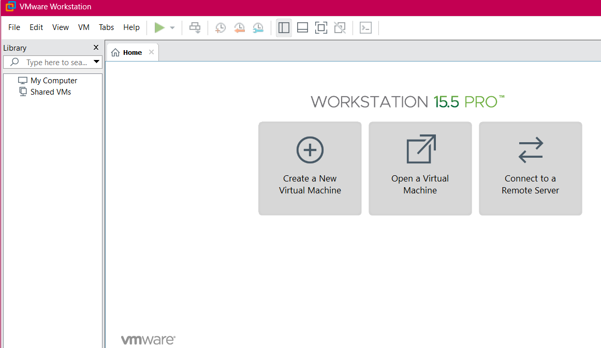
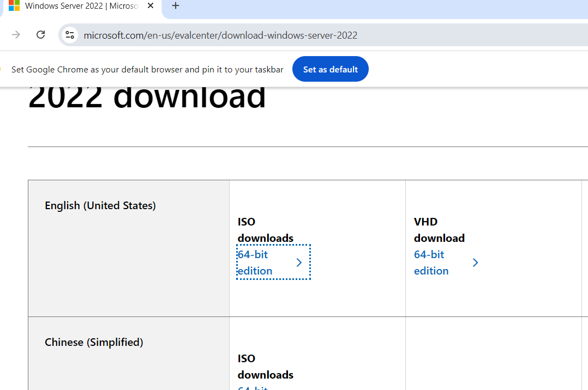
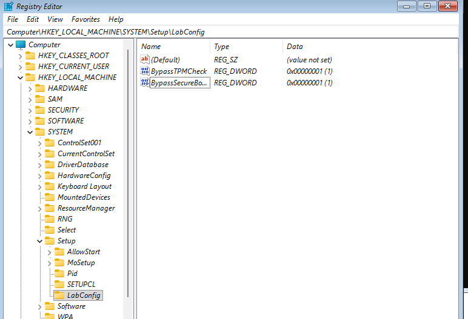

# Windows Active Directory Home Lab

## 1. VMware Workstation Installation
I installed VMware to host my isolated testing environment.

## 2. Windows Server 2022 Installation
I deployed Windows Server 2022 to act as the Domain Controller. 

## 3. Windows 11 Installation
I installed Windows 11 as the endpoint machine for security monitoring.

